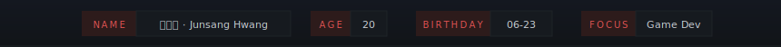

<!-- HERO BANNER SVG -->
<div align="center">
  
  
</div>

<br/>

## `about.cpp`

```cpp
// 안녕하세요! 게임 개발자 황준상입니다.

class Developer {
  public:
    string alias    = "KimNora07";
    string passion  = "Game Development";
    string engine   = "Unity";

    vector<string> currently() {
      return {
        "Unity 게임 프로젝트 개발 중",
      };
    }
};
```


## `stack.json`

<div align="center">

<table>
<tr>
  <th align="center" colspan="3">💬 Languages</th>
  <th align="center" colspan="3">⚙️ Engine & Tools</th>
</tr>
<tr>
  <td align="center" width="100"><br/><sub><b>C</b></sub><br/><sub><code>LANG</code></sub></td>
  <td align="center" width="100"><br/><sub><b>C++</b></sub><br/><sub><code>LANG</code></sub></td>
  <td align="center" width="100"><br/><sub><b>C#</b></sub><br/><sub><code>LANG</code></sub></td>
  <td align="center" width="100"><br/><sub><b>Unity</b></sub><br/><sub><code>ENGINE</code></sub></td>
  <td align="center" width="100"><br/><sub><b>VS</b></sub><br/><sub><code>IDE</code></sub></td>
  <td align="center" width="100"><br/><sub><b>Git</b></sub><br/><sub><code>VCS</code></sub></td>
</tr>
</table>

</div>


## `stats.exe`

<div align="center">


<br/>


</div>


## `links.sh`

<div align="center">

[](https://youtube.com/@KimNora07)
[](https://kimnora07.tistory.com)
[](mailto:your@gmail.com)

</div>
